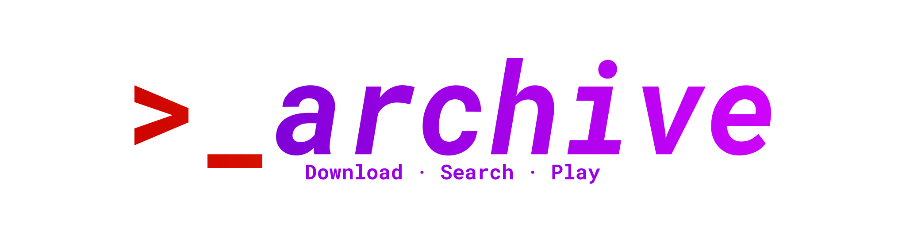
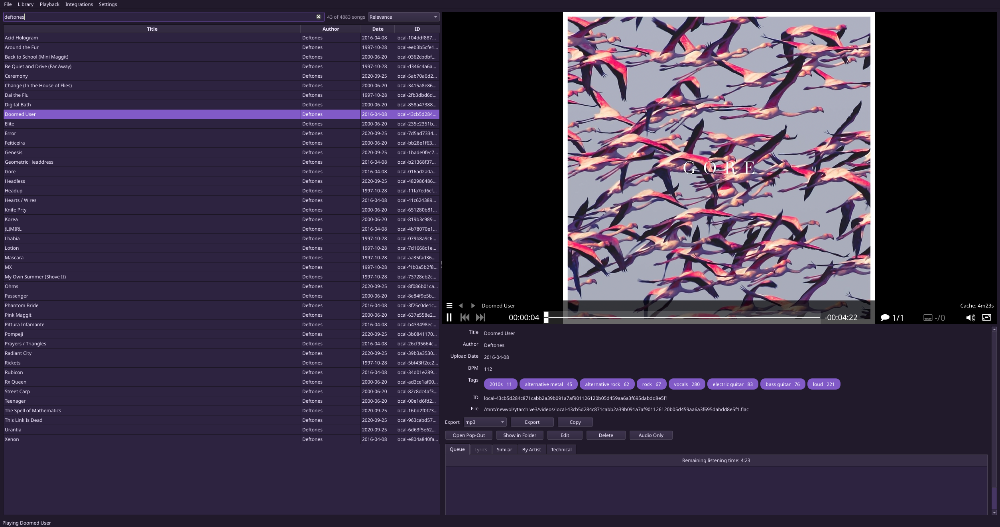

# ytarchive Library

<p align="center">
  
</p>

ytarchive Library is a desktop app for building a personal music and video
collection. Download media, import files, edit their details,
and play everything from your own local little library.

<p align="center">
  
</p>

> **Note:** This is an independent project and is not related
> to [Kethsar's ytarchive](https://github.com/Kethsar/ytarchive), the YouTube
> livestream downloader.

## Features

- Download from YouTube, SoundCloud, Spotify, Bandcamp, Monochrome, and direct
  media links.
- Import audio files, video files, and ZIP archives from your computer.
- Search your collection and edit titles, artists, dates, tags, BPM, and lyrics.
- Play media inside the app and build a listening queue.
- Find similar tracks or more music by the same artist.
- Export selected items from your library.
- Optionally listen from another device with a Subsonic-compatible app.
- Optionally show the current track as your Discord status.

## Install

The guided setup supports Windows and Linux. It keeps the app's Python packages
in their own private folder, creates shortcuts, and checks everything needed
for playback and downloads. You do not need to create or activate a Python
environment yourself.

### Windows

1. Open the [latest release](../../releases/latest) and download the file named
   `ytarchive-lib-...-setup.zip`.
2. Right-click the downloaded ZIP and choose **Extract All**.
3. Open the extracted folder and double-click **install-windows.bat**.
4. Follow the prompts. Setup can use Windows Package Manager to install any
   missing requirements, then it creates Desktop and Start Menu shortcuts.
5. When setup finishes, start **ytarchive Library** and follow the wizard's instructions.

Windows may ask whether you want to allow the setup file to run because it was
downloaded from the internet.

### Linux

1. Open the [latest release](../../releases/latest) and download the file named
   `ytarchive-lib-...-setup.zip`.
2. Extract the ZIP, then open a terminal in the extracted folder.
3. Run:

   ```sh
   sh install-linux.sh
   ```

4. Follow the prompts. On Ubuntu and Debian, setup can install missing system
   packages with `apt`. It then adds ytarchive Library to your application
   menu.
5. Open **ytarchive Library** and follow the first-run wizard.

On another Linux distribution, install Python, mpv, and FFmpeg with its normal
software manager first. The setup helper will tell you if anything is still
missing.

### What setup installs

ytarchive Library needs a few separate, open-source tools:

| Requirement | Why it is needed | Installation help |
| --- | --- | --- |
| Python 3.10 or newer | Runs the application | [Download Python](https://www.python.org/downloads/) |
| mpv | Plays audio and video inside the app | [Install mpv](https://mpv.io/installation/) |
| FFmpeg, including ffprobe | Examines and converts media | [Download FFmpeg](https://ffmpeg.org/download.html) |
| Deno | Helps yt-dlp handle current website requirements | [Install Deno](https://docs.deno.com/runtime/getting_started/installation/) |

The Windows helper offers to install these through Windows Package Manager.
The Linux helper offers to install the system packages automatically on
Ubuntu and Debian. ytarchive Library itself is installed only for your user
account; `apt` may ask for your administrator password for system packages.

The setup helpers do **not** put your media inside the application folder.
You choose a separate library data folder on first launch.

### Updating the app

Download the newest setup ZIP, extract it, and run the setup helper again. It
updates the existing installation and leaves your library and settings alone.

## First launch

The first-run wizard asks where to keep your library data. This folder
contains your downloaded media, imported-file records, artwork, playlists, settings,
exports, and logs. Choose a folder with enough free space and include the whole
folder in your backups.

The wizard also checks the tools listed above. If a required item is missing,
install it and run the check again. You can repeat the check later with the
diagnostic command under [Troubleshooting](#troubleshooting).

You can move the complete library later with **Settings → Library → Move
data…**. Use **Settings → Library → Open existing…** to open a library that is
already on the computer.

## Add media

Choose **File → Add New** in the app.

- Use **Online** to paste one link or media ID per line.
- Use **Local File** to import files or ZIP archives from your computer. You can
  enter a title, artist, date, and tags while importing.

Some age-restricted or account-only downloads need cookies from a web browser.
Cookie selection and testing are under **Settings → Downloads**. Only use this
with an account and content you are permitted to access.

## Where your files are stored

The first-run wizard lets you choose the library data folder. If you accept the
suggested location, it is:

| Platform | Default library data folder |
| --- | --- |
| Linux | `$XDG_DATA_HOME/ytarchive`, or `~/.local/share/ytarchive` |
| macOS | `~/Library/Application Support/ytarchive` |
| Windows | `%LOCALAPPDATA%\ytarchive` |

The application itself and your library use separate folders. Removing or
updating the app does not remove the library.

The folder is still named `ytarchive` so libraries created by older versions
continue to open normally.

## Optional features

### Listen from another device

ytarchive Library includes a read-only Subsonic-compatible server. This lets a
Subsonic music app on your phone or another computer read and play your
library.

1. Open **Settings → Integrations**.
2. Enable the Subsonic server and set a strong password.
3. Start it from **Integrations → Subsonic Server**.
4. In your Subsonic client, enter this computer's local network address and the
   configured port.

Keep this server on your trusted home network. Do not expose it directly to the
public internet.

### Discord status and BPM detection

Discord Rich Presence and automatic BPM detection are optional. The app works
without them. They require the `pypresence` and `aubio` Python packages,
respectively; see [Manual installation](#manual-installation) if you want to
include every optional integration.

## Troubleshooting

If playback or a download does not work, run the dependency check first:

```sh
ytarchive-lib doctor
```

It lists the missing item and explains what to install. If the short command is
not available in your terminal, use the default full path for your platform:

- Windows Command Prompt: `"%LOCALAPPDATA%\ytarchive-lib\app\Scripts\ytarchive-lib.exe" doctor`
- Windows PowerShell: `& "$env:LOCALAPPDATA\ytarchive-lib\app\Scripts\ytarchive-lib.exe" doctor`
- Linux: `~/.local/share/ytarchive-lib/app/bin/ytarchive-lib doctor`

The application log is named `ytarchive.log` and is inside the active library
data folder. See the [FAQ](FAQ.md) for help with common problems.

## Manual installation

This section is for users who prefer the command line, macOS users, and
contributors. Install Python 3.10 or newer, mpv, FFmpeg, and Deno first. From
an extracted source archive or repository checkout, run:

```sh
python3 -m venv .venv
. .venv/bin/activate
python -m pip install --upgrade pip
python -m pip install .
ytarchive-lib
```

In Windows PowerShell, use these commands instead:

```powershell
py -3 -m venv .venv
& ".\.venv\Scripts\python.exe" -m pip install --upgrade pip
& ".\.venv\Scripts\python.exe" -m pip install .
& ".\.venv\Scripts\ytarchive-lib.exe"
```

To install Discord Rich Presence and automatic BPM detection too, replace
`python -m pip install .` with:

```sh
python -m pip install ".[all]"
```

On Linux, create an application-menu shortcut after a manual installation:

```sh
ytarchive-lib shortcuts
```

On Windows, create the Desktop and Start Menu shortcuts with:

```powershell
& ".\.venv\Scripts\ytarchive-lib.exe" shortcuts
```

Advanced commands, including the read-only server, support a custom library
folder with `--root`:

```sh
ytarchive-lib --root /path/to/library-data
ytarchive-lib doctor
ytarchive-lib-server --root /path/to/library-data
```

## Development

Install development dependencies and run the test suite from the repository
folder:

```sh
python -m pip install -e ".[dev]"
python -m pytest -q
python -m build
```

Continuous integration tests supported Python versions on Linux and Windows
and builds the Python distribution files. Tagged public releases also contain
the guided setup bundle used by the instructions above.

## License

ytarchive Library is licensed under the GNU General Public License, version 3
or any later version. See [LICENSE](LICENSE) for the complete terms. The
software is provided "as is" without warranty.

Third-party dependencies, external tools, downloaded media, artwork, and
trademarks remain subject to their own licenses or terms. See
[THIRD_PARTY_NOTICES.md](THIRD_PARTY_NOTICES.md) for details.

## Credits

- Online downloads use [yt-dlp](https://github.com/yt-dlp/yt-dlp).
- The interface uses [Qt for Python](https://doc.qt.io/qtforpython-6/).
- Playback uses [mpv](https://mpv.io/), and media processing uses
  [FFmpeg](https://ffmpeg.org/).
- Optional BPM analysis uses [aubio](https://github.com/aubio/aubio).

These are independent projects and are not affiliated with ytarchive Library.
